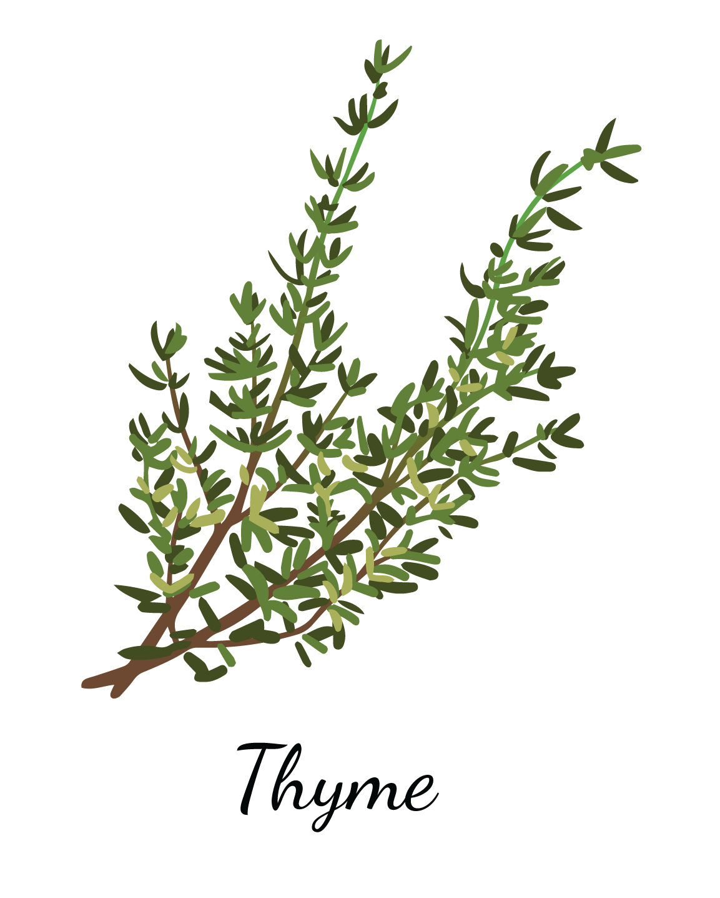

# Thyme

<p align="center">
  
</p>

<p align="center">
A PostCSS utility first CSS for **modern browsers.**
</p>

## Why?

To learn deep aspects of css, that's all.

## Features

- Themeable
- Responsive classes
- Pseudo classes

```html
<!-- responsive classes -->
<div class="flex md:flex-column xl:flex-row">...</div>

<!-- pseudo classes -->
<button class="interactive-01 hover:interactive-01-hover">...</button>
```

## TODO:

- set naming convention
- set browsers versions and "stage"
- choose builder/runner (rollup, webpack, parce, esbuild??)
- testing
- deploy method

**Illustration**

<a href="https://www.freepik.es/vectors/flor">Vector de Flor creado por macrovector - www.freepik.es</a>
